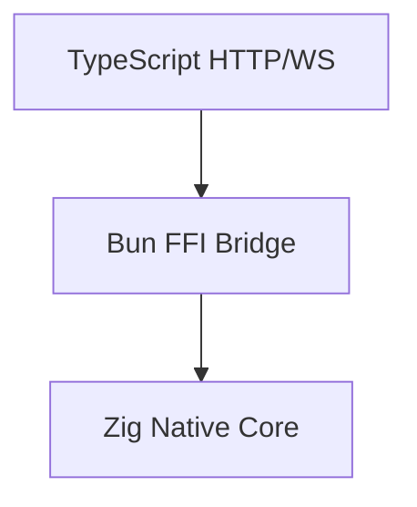

# Architecture

The Zig core compiles to a shared library. The TypeScript layer loads it via Bun FFI.

```mermaid
graph TD
    A[TypeScript HTTP/WS] --> B[Bun FFI Bridge]
    B --> C[Zig Native Core]
```